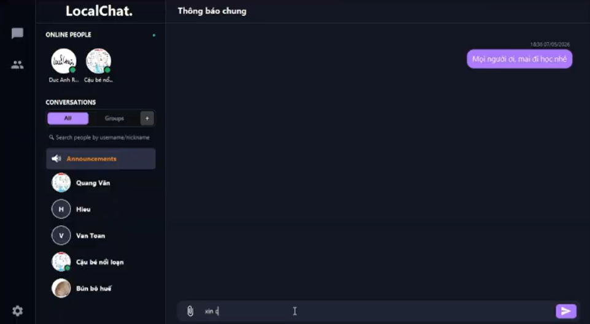

# LocalChat - Phần mềm nhắn tin nội bộ.

## 1. Thông Tin Nhóm

**Tên Dự Án:** LocalChat

**Thành Viên Nhóm:**
- [Nguyễn Đức Anh](https://github.com/DucAnh31)
- [Nguyễn Văn Quang](https://github.com/QuangNV1204)
- [Lê Đình Hiếu](https://github.com/edhlii)

### Mô hình làm việc

Team hoạt động theo mô hình Scrum, sử dụng Linear để quản lý công việc.

Mỗi tuần, team sẽ ngồi lại để review công việc đã làm, cùng nhau giải quyết vấn đề và đề xuất giải pháp cho tuần tiếp theo.

### Version Control Strategy

Team hoạt động theo Gitflow để quản lý code. Mỗi thành viên sẽ tạo branch từ `main` để làm việc, các branch đặt theo format `feature/ten-chuc-nang`, sau khi hoàn thành sẽ tạo Pull Request để review code và merge vào develop
- Các nhánh chính:
  - `main`: Chứa code ổn định, đã qua kiểm tra và test kỹ lưỡng
  - `feature/`: Các nhánh chứa code đang phát triển, short-live, sau khi hoàn thành sẽ review và merge vào `main`. 

[Sơ đồ commit](gitgraph.txt)

## 2. Giới Thiệu Dự Án

**Mô tả:** Một ứng dụng chat Java gọn nhẹ hỗ trợ nhắn tin văn bản, chat nhóm, gọi thoại/video và chia sẻ màn hình. Repository này chứa cả thành phần client và server được sử dụng để chạy thử nghiệm và phát triển ở môi trường local.

## 3. Các Chức Năng Chính

- Đăng nhập
- Nhắn tin
- Gửi ảnh, file,...
- Nghe, gọi
- Gọi video, chia sẻ màn hình
- Phân quyền Manager, Member
- Thêm, xoá, sửa thành viên
- Tuỳ chỉnh profile
- Tạo nhóm

## 4. Công nghệ

### 4.1. Công Nghệ Sử Dụng

- Java 8+
- JavaFX (sử dụng FXML cho các view)
- Maven để build và quản lý thư viện (dependency)
- Plain sockets / các module mạng tùy chỉnh cho giao tiếp thời gian thực
- Database: MySQL

### 4.2 Cấu trúc dự án

```
├── src
│   └── main
│       ├── java
│       │   └── org
│       │       └── proptit
│       │           └── localchat
│       │               ├── MainApp.java
│       │               ├── RunApp.java
│       │               ├── client
│       │               │   ├── controller
│       │               │   │   ├── CallWindowController.java
│       │               │   │   ├── ChangePasswordController.java
│       │               │   │   ├── ChatCallManager.java
│       │               │   │   ├── ChatCallView.java
│       │               │   │   ├── ChatController.java
│       │               │   │   ├── CreateGroupController.java
│       │               │   │   ├── GroupManagerController.java
│       │               │   │   ├── LoginController.java
│       │               │   │   ├── MainWindowController.java
│       │               │   │   ├── MemberManagementController.java
│       │               │   │   └── UserSettingsController.java
│       │               │   └── networks
│       │               │       ├── ScreenShareSession.java
│       │               │       ├── SocketClient.java
│       │               │       ├── VideoCallSession.java
│       │               │       └── VoiceCallSession.java
│       │               ├── common
│       │               │   ├── enums
│       │               │   │   ├── TypeDataPacket.java
│       │               │   │   └── TypeMessage.java
│       │               │   ├── models
│       │               │   │   ├── ChatGroup.java
│       │               │   │   ├── DataPacket.java
│       │               │   │   ├── User.java
│       │               │   │   ├── call
│       │               │   │   │   ├── CallAction.java
│       │               │   │   │   └── CallSignal.java
│       │               │   │   └── message
│       │               │   │       ├── FileMessage.java
│       │               │   │       ├── ImageMessage.java
│       │               │   │       ├── Message.java
│       │               │   │       └── TextMessage.java
│       │               │   └── utils
│       │               │       ├── FileUtils.java
│       │               │       └── PasswordUtils.java
│       │               └── server
│       │                   ├── ServerRun.java
│       │                   ├── config
│       │                   │   └── StorageConfig.java
│       │                   ├── controller
│       │                   │   └── ClientHandler.java
│       │                   ├── dao
│       │                   │   ├── DbConfig.java
│       │                   │   ├── DbConnection.java
│       │                   │   ├── GroupDao.java
│       │                   │   ├── MessageDao.java
│       │                   │   └── UserDao.java
│       │                   ├── networks
│       │                   │   └── SocketServer.java
│       │                   ├── services
│       │                   │   ├── AuthService.java
│       │                   │   ├── ChatService.java
│       │                   │   └── StorageFileService.java
│       │                   └── utils
│       │                       └── ServerLogger.java
│       └── resources
│           └── org
│               └── proptit
│                   └── localchat
│                       ├── call_window.fxml
│                       ├── change_password.fxml
│                       ├── chat.css
│                       ├── chat_view.fxml
│                       ├── create_group.css
│                       ├── create_group.fxml
│                       ├── images
│                       │   ├── banner.png
│                       │   └── localchat.png
│                       ├── login.css
│                       ├── login_view.fxml
│                       ├── main.css
│                       ├── main_window.fxml
│                       ├── manage_group.fxml
│                       ├── member.css
│                       ├── member_management_view.fxml
│                       ├── modal.css
│                       └── user_setting.fxml
...
```

Diễn giải:
- `src/main/java/org/proptit/localchat` — package Java cấp cao nhất
- `client/controller` — Các controller JavaFX cho các view (đăng nhập, chat, cuộc gọi, cài đặt)
- `client/networks` — Mạng client: sockets, phiên cuộc gọi
- `server` — Code phía server (controllers, DAOs, services, networking)
- `common` — Các model, enum và tiện ích dùng chung
- `src/main/resources/org/proptit/localchat` — Các file view FXML và CSS
- `buildDB` — Script khởi tạo SQL local

Các file hữu ích

- `src/main/java/org/proptit/localchat/RunApp.java` — Entry point
- `src/main/java/org/proptit/localchat/server/ServerRun.java` — Điểm khởi chạy của server
- `buildDB/build_local_sql.sql` — Cấu trúc DB và dữ liệu mẫu (seed data)

## 5. Ảnh và Video Demo

**Ảnh Demo:**


**Video Demo:**
[LocalChat Video demo](https://www.youtube.com/watch?v=2X_t_JbJrLI)

## 6. Các Vấn Đề Gặp Phải

### Vấn Đề 1: Fix cứng IP server.

Hiện tại client đang kết nối tới một IP server duy nhất, không sửa được.

### Hành Động Để Giải Quyết

**Giải pháp:** Yêu cầu User nhập IP server khi đăng nhập vào mạng lần đầu tiên. Các lần sau không cần thực hiện nữa. Sẽ được nâng cấp vào các bản cập nhật sau.

### Vấn Đề 2: UI chat che phần hiển thị danh bạ.

Khi nhắn tin quá dài, khung chat sẽ che mất đoạn hiển thị danh bạ.

### Hành Động Để Giải Quyết

**Giải pháp:** Sửa lại logic thêm tin nhắn vào màn hình.

### Kết Quả

- Fix thành công.

## 7. Kết Luận

**Kết quả đạt được:** Xây dựng thành công app nhắn tin với đầy đủ chức năng cơ bản.

**Hướng phát triển tiếp theo:** Nâng cấp tự động dò server khi kết nối tới mạng LAN.